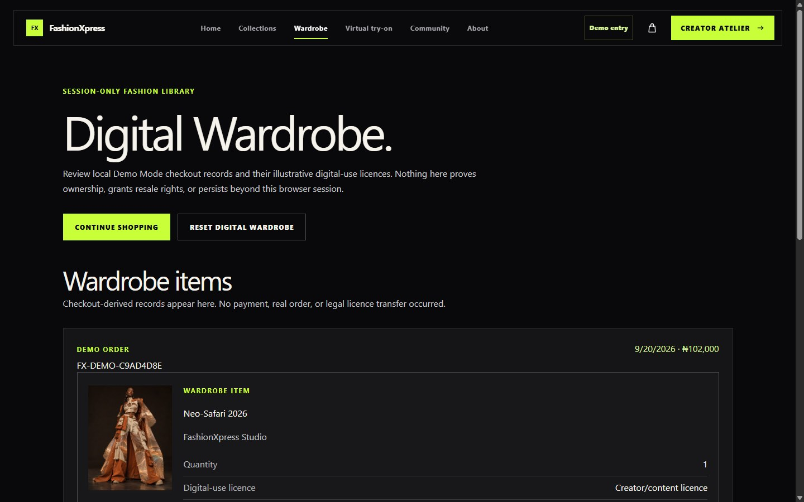
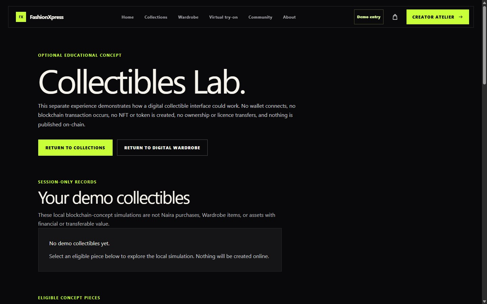

# FashionXpress

**African digital fashion with Naira pricing, licence-based access, and an honest local-first portfolio experience.**


[](https://react.dev/)
[](https://vite.dev/)
[](#demo-mode)

## Live demo and repository

- **Live demo:** [fashion-xpress.vercel.app](https://fashion-xpress.vercel.app)
- **Repository:** [github.com/Youngee2024/fashion-xpress](https://github.com/Youngee2024/fashion-xpress)
- **Public mode:** Demo Mode; provider-backed services are not active on the portfolio deployment.

## Project overview

FashionXpress is a polished African digital-fashion e-commerce portfolio prototype combining editorial discovery, clear Naira pricing, digital-use licences, Virtual Try-On, creator experiences, Community, and an optional Collectibles Lab. It began as static legacy pages and now runs as a modular React application with shared data, accessible interactions, and explicit boundaries between demonstration behavior and real services.

The experience is designed to feel ambitious without pretending that a payment, blockchain transaction, body-tracking system or live publication occurred.

## The problem

Digital-fashion concepts often borrow the language of commerce and Web3 before the underlying services exist. That can make an otherwise polished prototype confusing: visitors cannot tell what is interactive, what is simulated and what happens to their data.

The original site also needed a coherent component system, resilient routing, responsive layouts and complete states for forms, drawers and multi-step journeys.

## The design response

The redesign treats the product as a fashion editorial first. Large typography, full-bleed imagery, restrained cream surfaces and acid-lime actions create a recognisable visual language. Under that surface, every prototype flow is deliberately honest: actions remain usable, but completion copy states exactly what did not happen.

## Target audience

- Recruiters and product teams reviewing end-to-end UI/UX and frontend craft
- Digital-fashion creators exploring new presentation formats
- Digital wearers and culture-focused visitors exploring expressive garments
- Designers and developers evaluating accessible, safety-conscious prototypes

## Core experiences

| Experience | What a visitor can do |
| --- | --- |
| Fashion discovery | Browse nine pieces by release tier and planned licence allocation, then open detailed editorial views. |
| Bag and checkout | Change quantities, choose digital-use licences and complete a local Naira checkout demonstration. |
| Collectibles Lab | Optionally review metadata, activate a fictional Demo Wallet and create a session-only demo collectible. |
| Virtual Try-On | Use a camera or local image, position a garment manually and download the local composition. |
| Community | Enter with a fictional identity, create discussions, reply, like and preview reporting locally. |
| Creator and contact flows | Complete validation and reach an explicit unsent Demo completion state. |
| Digital Wardrobe | Review session-only Naira checkout records and selected illustrative licences. |

## Demo Mode

`VITE_APP_MODE=demo` is the safe default. Missing or invalid values also resolve to Demo Mode.

In this mode, Contact, Creator Application and Newsletter validate normally but make no API request, send no email and create no database record. Community activity stays in memory. Checkout and optional Collectibles Lab records are separate and session-only. Virtual Try-On processing stays on the device. The bag alone uses namespaced local storage so quantities survive a return visit.

Demo completion is not presented as a real transaction. The interface explicitly states that there is no payment, order, wallet connection, blockchain transaction, token, ownership transfer, body tracking or online Community publication.

## Featured screens


| Collection discovery | Product detail |
| --- | --- |
|  |  |

| Demo checkout | Local Virtual Try-On |
| --- | --- |
|  |  |

| Digital Wardrobe | Optional Collectibles Lab |
| --- | --- |
|  |  |

More screens and the full product narrative are available in the [case study](docs/CASE-STUDY.md).

## UX decisions

- **Truth before spectacle:** each simulated action is paired with plain-language consequences.
- **Editorial hierarchy:** expressive display type leads; dense controls stay structured and quiet.
- **Progressive journeys:** checkout and the optional Collectibles Lab use guarded steps, visible progress and recoverable state.
- **Clear separation:** Naira checkout records belong to Digital Wardrobe; collectible simulations remain inside Collectibles Lab.
- **Local creative control:** Virtual Try-On uses manual positioning instead of implying unavailable body tracking.
- **Useful failure states:** invalid routes, unavailable services, corrupt session data and empty collections recover safely.

## Accessibility and responsive design

The application includes a skip link, semantic landmarks, route-specific titles, labelled form controls, keyboard-operable selections, visible high-contrast focus states and reduced-motion support. The cart behaves as an accessible modal dialog with focus trapping, Escape closing, focus restoration and background scroll locking.

Layouts were verified from compact 320px screens through large desktop widths during final QA. Touch targets are designed around a 44px minimum, long identifiers wrap, and the application avoids global overflow masking.

## Technology stack

| Area | Technology |
| --- | --- |
| Interface | React 19, React Router 7, JSX |
| Styling | Tailwind CSS 4 through the Vite plugin, plus project-specific CSS |
| Build | Vite 7 |
| Demo state | React state, namespaced `localStorage` and `sessionStorage` |
| Prepared Live services | Vercel Functions, Supabase Auth/Postgres/RLS, Resend |
| Quality | ESLint, Node test runner, browser smoke and route-matrix utilities |
| Deployment | Vercel SPA routing with API and static-asset exclusions |

## Application architecture

```text
src/
|-- auth/          # Demo identity and prepared Supabase Auth boundary
|-- components/    # Shared navigation, drawer, cards and workflow UI
|-- data/          # Product records, validation, calculations and storage guards
|-- hooks/         # Community and service-availability orchestration
|-- pages/         # Route-level experiences
api/               # Protected Vercel Functions for prepared Live workflows
supabase/           # Reviewed migrations and policy checks
docs/               # Setup guides, case study and launch material
```

Trusted product data feeds collection, product, checkout, Collectibles Lab and Try-On views. Demo utilities validate stored records before use and discard corrupt data. Mode selection is centralised, while provider-backed code remains separated behind Live configuration checks.

## Demo versus Live capability

| Capability | Demo Mode - public portfolio | Live Mode - prepared, inactive |
| --- | --- | --- |
| Contact and creator forms | Validated in memory; explicitly not sent | Protected API, Supabase storage and Resend notifications when fully configured |
| Newsletter | Validated in memory; explicitly not subscribed | Prepared double opt-in, confirmation and unsubscribe workflow |
| Authentication | Fictional in-memory Runway Guest | Prepared Supabase email OTP |
| Community | In-memory posts, replies, likes and report previews | Prepared RLS-protected Supabase publishing |
| Checkout | Local interface demonstration; no payment or order | No real checkout implementation |
| Collectibles Lab | Fictional wallet and session-only demo records | No real wallet, smart contract or blockchain implementation |
| Virtual Try-On | On-device camera/photo composition and download | No server upload, body tracking or fit assessment |

Live workflows fail closed when required configuration is unavailable; they never substitute simulated success. Provider setup and real-environment verification are still required before any Live activation.

## Local setup

```bash
git clone https://github.com/Youngee2024/fashion-xpress.git
cd fashion-xpress
npm install
cp .env.example .env.local
npm run dev
```

Keep `VITE_APP_MODE=demo` for the portfolio experience. No provider credentials are required.

## Environment configuration

The committed [.env.example](.env.example) contains names only and the safe Demo default.

| Variable | Exposure | Use |
| --- | --- | --- |
| `VITE_APP_MODE` | Public | `demo` or `live`; invalid and missing values become `demo`. |
| `VITE_SUPABASE_URL` | Public in Live Mode | Supabase project URL for Auth and Community. |
| `VITE_SUPABASE_ANON_KEY` | Public in Live Mode | Publishable/anon key protected by RLS; never a service-role key. |
| `SUPABASE_URL`, `SUPABASE_SERVICE_ROLE_KEY` | Server only | Protected database operations. |
| `RESEND_API_KEY`, `EMAIL_FROM`, `EMAIL_ADMIN_TO` | Server only | Prepared email workflows. |
| `PUBLIC_APP_URL`, `FORM_SECURITY_SECRET` | Server only | Safe links and request hashing. |

See [Live-service readiness](docs/live-service-readiness.md) before considering Live Mode. Never give a secret a `VITE_` prefix.

## Available commands

| Command | Purpose |
| --- | --- |
| `npm run dev` | Start the Vite development server. |
| `npm run dev:full` | Run the app with local Vercel Functions. |
| `npm run build` | Create the production bundle. |
| `npm run preview` | Preview the production bundle locally. |
| `npm run lint` | Run the repository ESLint configuration. |
| `npm test` | Run the Node-based automated test suite. |
| `npm run readiness` | Check Demo deployment readiness without contacting providers. |
| `npm run readiness -- --mode=live` | Validate the shape of an isolated Live configuration without printing values. |

## Testing and QA summary

Final production QA covered automated regression tests, ESLint, the production build, direct route navigation and refreshes, keyboard journeys, console and network monitoring, broken images, horizontal overflow and a viewport matrix from 320px to 1920px. The selected images in this repository come from that verified Phase 9 capture set.

Provider-backed Live behavior still requires isolated Supabase, Resend and Vercel staging tests; repository mocks cannot prove external email delivery, database policy deployment or provider configuration.

## Privacy and security approach

- Demo forms keep personal input in component memory and clear it after acknowledgement.
- Demo Community data stays in memory and is not published.
- Digital Wardrobe and Collectibles Lab records use separate, validated session-only namespaces with reset controls.
- Virtual Try-On does not upload photos or derive biometric measurements.
- Server credentials are excluded from frontend variables and browser bundles.
- Live API routes restrict methods and content types, validate input and return safe public errors.
- Supabase migrations enable RLS; privileged submission tables are not browser-readable.
- Vercel adds CSP, Permissions Policy, referrer and framing protections.

Read the in-app Privacy, Terms, Licensing, Purchase Status and Accessibility pages for visitor-facing details.

## Current limitations

- The public deployment is a portfolio demonstration, not a production marketplace.
- No payment, order, fulfilment, ownership transfer or real licence grant exists.
- No real wallet, network, smart contract, token, scarcity or on-chain asset exists.
- Virtual Try-On is manual composition, not body tracking, fit analysis or sizing advice.
- Demo Community activity disappears when its in-memory session resets.
- Live Supabase and Resend integrations are prepared in code but not verified as active services here.
- Cross-browser, real-device camera and assistive-technology checks remain part of deployment ownership.

## Future roadmap

- Validate prepared Live workflows in isolated staging with disposable provider resources.
- Complete formal assistive-technology and real-device camera testing.
- Add a moderation operations interface before any public Community launch.
- Define legal, fulfilment, licensing and support processes before real commerce.
- Treat payments, production body tracking and blockchain functionality as separate security and product programmes, not prototype toggles.

## Project status

**Portfolio-ready in Demo Mode.** The interface and local journeys are complete for presentation. Live-service code is an inactive readiness layer and must not be enabled until provider configuration, operational ownership, privacy review and staging verification are complete.

## Credits

FashionXpress is an independent end-to-end UI/UX and frontend portfolio project. The product direction, UX writing, interaction architecture and implementation are presented as one cohesive case study.

Built with [React](https://react.dev/), [Vite](https://vite.dev/), [Tailwind CSS](https://tailwindcss.com/), [Supabase](https://supabase.com/), [Resend](https://resend.com/) and [Vercel](https://vercel.com/). Fashion imagery and brand assets are included in the project repository; redistribution rights should be confirmed before external editorial or commercial reuse.
