# FashionXpress case study

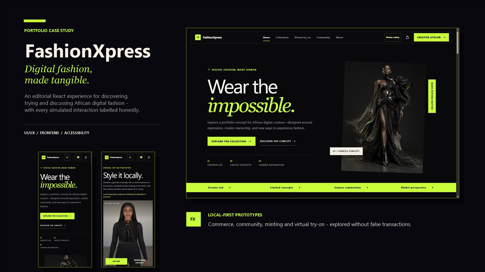

## Project snapshot

| | |
| --- | --- |
| Product | Responsive digital-fashion portfolio prototype |
| Focus | UI/UX design, frontend architecture, accessibility and prototype integrity |
| Public state | Demo Mode |
| Platform | Responsive web application |
| Stack | React 19, React Router 7, Vite 7, Tailwind CSS 4, Vercel |
| Prepared services | Supabase and Resend integrations, inactive until Live Mode is deliberately configured |

FashionXpress brings African fashion discovery, Naira-priced licence selection, on-device styling and creative community into one editorial interface, with blockchain collecting retained only as an optional educational Lab.

## My role

The project combines product direction, information architecture, interaction design, UX writing, responsive interface design, accessibility work and frontend development. The implementation also covers guarded local state, secure service boundaries, deployment configuration, automated checks and final production QA.

No claim is made here about a wider delivery team, commissioned client work or production adoption.

## Project type

An independent, portfolio-focused product concept and legacy-to-React modernization. It demonstrates how an expressive fashion experience can remain clear about privacy, capability and transactional limits.

## Timeline

**Portfolio placeholder:** add the confirmed project start and completion dates before publishing this case study externally.

The repository history remains the source of truth for implementation phases and commit dates.

## Challenge

The initial experience was distributed across legacy HTML pages with inconsistent navigation and limited shared behavior. The larger design challenge was not simply modernization: it was building a credible licence-based commerce journey while keeping speculative collecting and Virtual Try-On honest about unavailable technology.

The resulting product needed to:

- Preserve a high-fashion editorial character across many routes.
- Connect discovery, product, bag, licence-first checkout, Digital Wardrobe, Virtual Try-On and Community journeys.
- Work at compact mobile widths without hiding layout problems.
- Make every simulated outcome honest and understandable.
- Keep personal data and provider credentials out of the public Demo experience.
- Prepare future service boundaries without turning them on prematurely.

## Product vision

Create a digital fashion house where African creative direction is presented with the confidence of an editorial campaign and the usability of a modern product. Visitors should be able to explore ambitious interface ideas while always knowing what is local, simulated, prepared for Live Mode or not yet available.

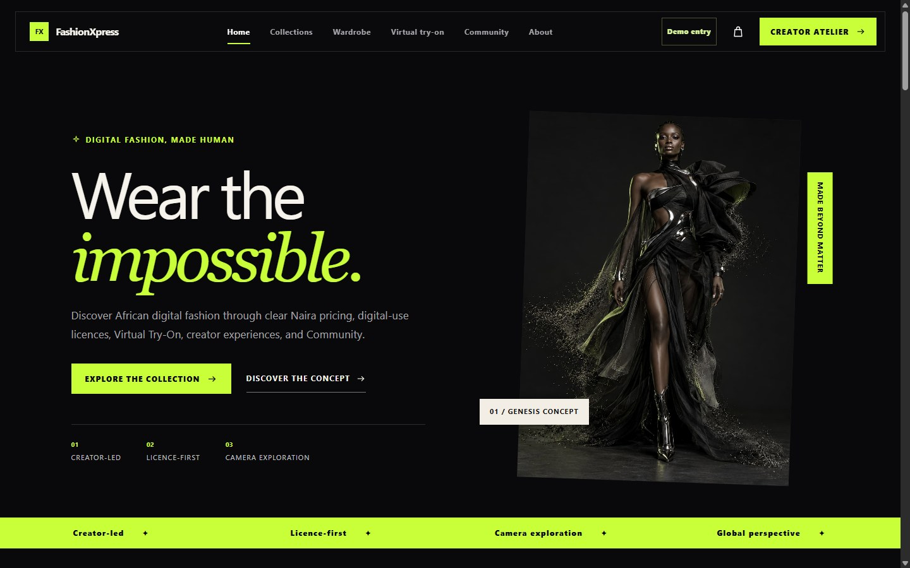

## Audience

The primary portfolio audience is recruiters, product teams and UI/UX clients evaluating product thinking and implementation quality. Within the concept itself, the experience speaks to creators, digital wearers and culture-focused visitors who want expressive discovery without technical ambiguity.

## Design principles

1. **Editorial, not ornamental.** Typography and imagery establish a strong point of view while controls remain readable.
2. **Show the boundary.** A prototype label should clarify an interaction, not excuse an incomplete one.
3. **Local by default.** Demonstration journeys should work without sending personal data or calling unnecessary services.
4. **Progress must be recoverable.** Multi-step flows preserve valid choices, reject corrupt state and offer clear ways back.
5. **Accessibility belongs in the component model.** Focus, semantics, touch targets and reduced motion are system decisions.

## Visual direction

The visual system uses charcoal black as a gallery-like ground, warm cream for contrast and acid lime for active moments. Oversized sans-serif headlines are paired with italic serif phrases to create an editorial rhythm. Fine rules, compact uppercase labels and disciplined spacing keep functional areas precise.

The imagery is allowed to lead, but product-detail media uses full-body framing so the model and garment are not cropped at the head. Dense interfaces such as checkout and Collectibles Lab use quiet panels and a consistent step language rather than changing the brand tone.

| Desktop editorial scale | Compact mobile hierarchy |
| --- | --- |
|  | 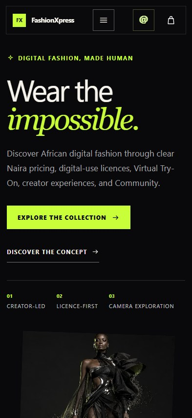 |

## Information architecture

The application is organised around five connected areas:

- **Discover:** Home, Collections and product detail.
- **Experience:** Virtual Try-On and product-specific concept entry points.
- **Build a Wardrobe:** Bag, licence-first Demo Checkout and Digital Wardrobe.
- **Explore optionally:** Collectibles Lab, clearly separated from commerce.
- **Participate:** Community, discussions, profiles and creator introduction.
- **Trust:** About, Contact, Privacy, Terms, Licensing, Purchase Status and Accessibility.

Shared navigation keeps these areas reachable, while contextual actions carry a selected product into the next journey. Direct URLs and refreshes are supported by React routing and Vercel's SPA fallback without intercepting API or asset requests.

## Key user journeys

### Fashion discovery

The home page establishes the world before asking for action. Collections then presents nine trusted product records with search, release-tier filters and Naira sorting. Product cards show planned licence allocations while making clear they are illustrative rather than live inventory.

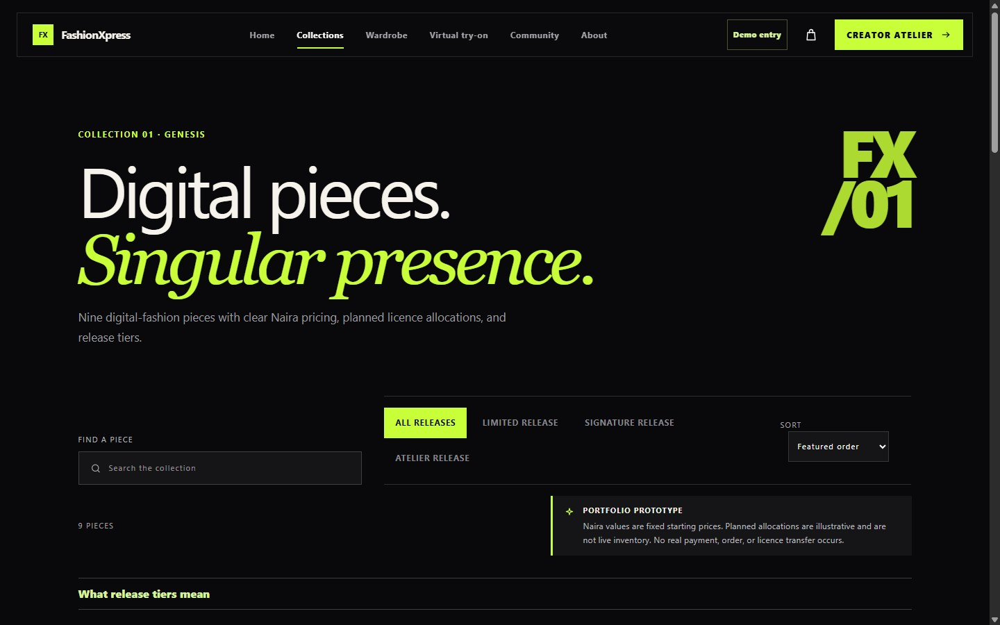

### Product detail

The detail view gives a selected garment enough vertical space for the full editorial shot, then groups story, release tier, planned allocation and format information. Add to bag and Virtual Try-On lead; Collectibles Lab appears as a separate secondary link.

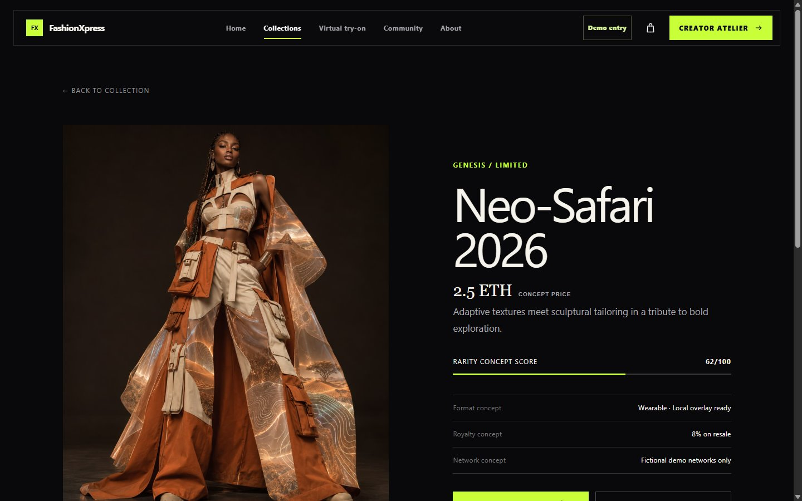

### Cart and demo checkout

The accessible cart drawer supports quantity changes and restores focus when closed. Checkout then moves through bag review, digital-use licence selection, a demo customer profile, payment-free demonstration and order review. Completion creates a session-only Digital Wardrobe record and states that no payment, order or legal licence transfer occurred.

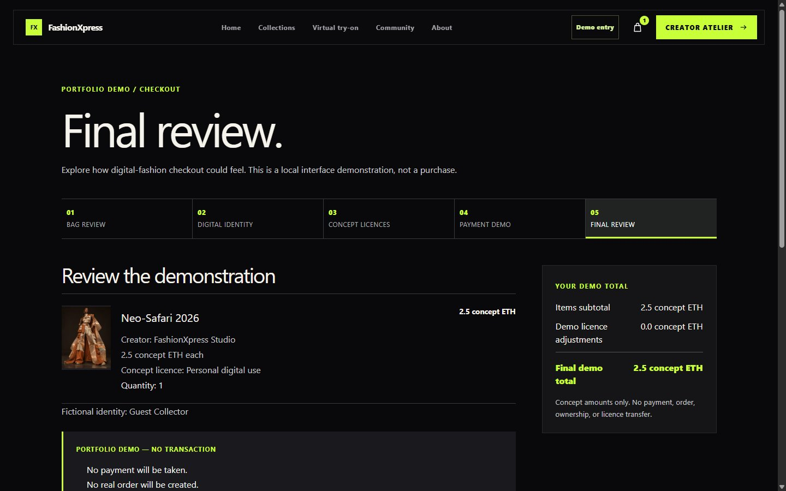

### Optional Collectibles Lab

Collectibles Lab derives metadata from trusted product data, uses a clearly fictional Demo Wallet and offers concept networks with deterministic demo-unit calculations. It is separate from Naira commerce. Before completion, the visitor acknowledges that no wallet permission, signature, gas charge, contract execution, publication, token or transfer will occur.

The progress sequence is labelled as a visual simulation. Stable `demo:` identifiers are stored only for the browser session.

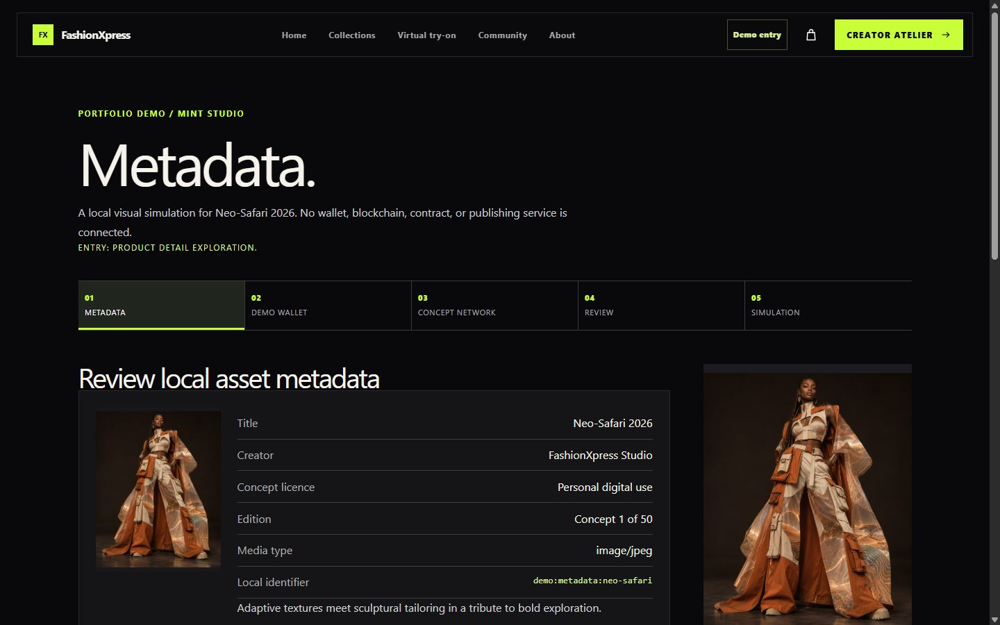

### Digital Wardrobe and local collectible records

Digital Wardrobe contains only checkout-derived Naira records. Optional demo collectibles live and can be reset independently inside Collectibles Lab. Both stores reject corrupt records, but their totals, references and meanings never mix.

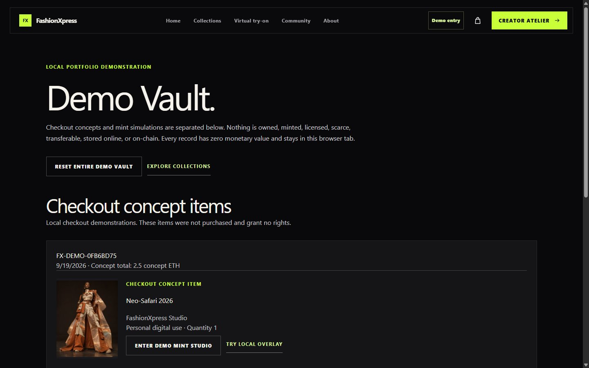

### Local Virtual Try-On

The Try-On prototype requests camera access only after a user action and also accepts a local image. Garments are positioned manually through visible controls and keyboard input. The composed image can be downloaded locally; no image is uploaded, persisted or analysed for body measurements, fit or sizing.

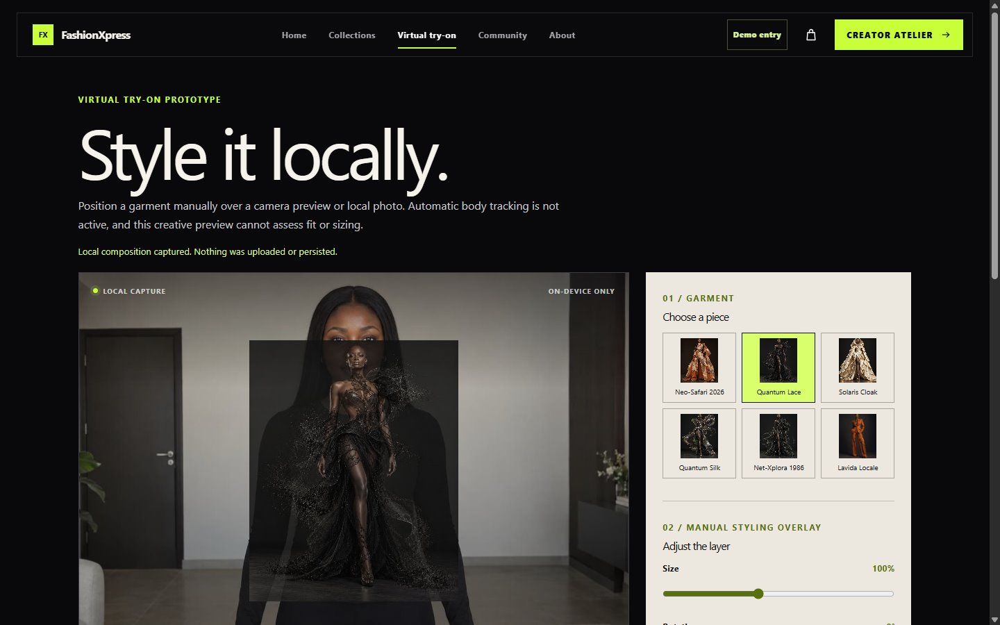

### Demo Community

In Demo Mode, a visitor enters as the fictional Runway Guest. Discussions, replies, likes and report previews stay in memory and are never published online. Empty, loading, error and reset states were designed alongside the main feed rather than added as afterthoughts.

| Community entry | Fictional profile |
| --- | --- |
| 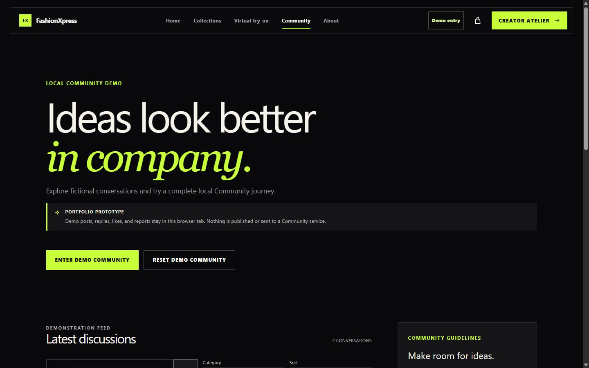 | 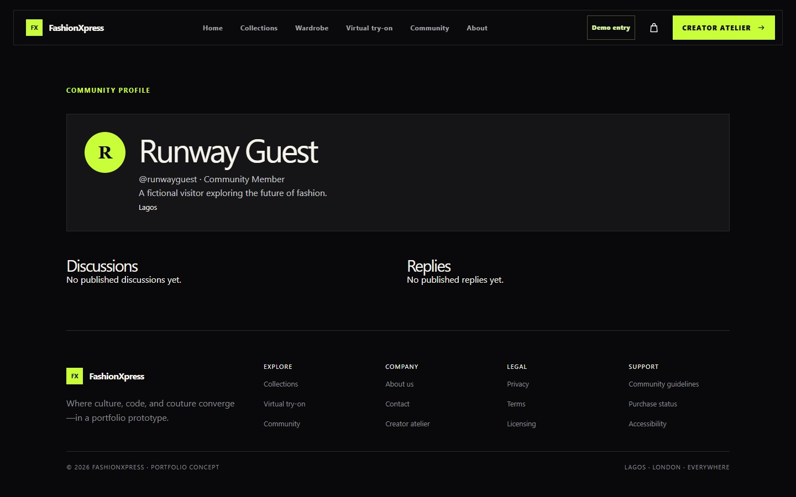 |

### Contact, creator and newsletter workflows

Each form retains real validation, consent, submitting and completion states. In Demo Mode, completion explicitly says the message was not sent, the application was not submitted or the email was not subscribed. Values remain in component memory and are cleared after acknowledgement.

Prepared Live Mode routes use protected Vercel Functions for Contact, Creator Application and double-opt-in Newsletter workflows, but they remain inactive on the portfolio deployment.

### Demo and Live architecture

One central mode value controls the presentation boundary:

- **Implemented Demo Mode:** local validation and interaction; no form APIs, provider email, submission database records or online Community publication.
- **Prepared but inactive Live Mode:** Supabase Auth, RLS-backed Community data and protected Supabase/Resend form workflows. Missing configuration fails closed rather than simulating success.
- **Future real services:** payment, fulfilment, production licensing, body tracking and blockchain functionality require separate product, legal, security and operational work. They are not hidden behind the mode switch.

## Responsive strategy

Desktop layouts use asymmetry, large media and generous editorial space. Tablet widths reduce columns without collapsing hierarchy. At compact widths, primary actions move earlier, control groups wrap deliberately and Collections retains a concise two-column card grid where practical.

The final viewport matrix covered 320, 375, 393, 768, 1024, 1440 and 1920 pixels. Long product names and demo identifiers wrap rather than forcing horizontal scrolling. No global overflow rule is used to conceal layout defects.

## Accessibility decisions

- A visible-on-focus skip link moves directly to main content.
- Route changes update the document title and description.
- Focus rings maintain strong contrast against black, cream and lime surfaces.
- The cart drawer uses dialog semantics, focus trapping, Escape closing and focus restoration.
- Filters and selectors expose pressed or checked state through native controls and ARIA where needed.
- Status, cancellation and completion copy uses live regions without over-announcing.
- Touch targets are designed around a 44 by 44 pixel minimum.
- Reduced-motion preferences remove non-essential transition and simulation motion.
- Form labels, inline errors, consent and disabled states remain explicit.

Formal testing with multiple screen readers and physical devices remains a launch-owner responsibility rather than an unverified claim.

## Prototype safety and honesty

| Area | What the interface does | What it does not claim |
| --- | --- | --- |
| Checkout | Calculates deterministic Naira licence totals and stores a local Wardrobe record | Payment, order, fulfilment, inventory reservation or legal licence transfer |
| Collectibles Lab | Demonstrates metadata, wallet, network and progress states separately | Wallet connection, signature, gas charge, contract execution or token creation |
| Try-On | Composes a local garment overlay | Body tracking, biometric analysis, fit or size accuracy |
| Community | Demonstrates publishing interactions in memory | Online publication, moderation response or persistent identity |
| Forms | Validates and demonstrates completion | Sending, subscribing or storing personal submissions in Demo Mode |

Live Mode does not silently fall back to a Demo success. If configuration is incomplete, the affected workflow is disabled and explains why.

## Technical implementation

React Router maps route-level pages into a shared layout. Central product records prevent detail, checkout, Collectibles Lab and Try-On views from drifting apart. Data utilities own input validation, integer calculations, storage namespaces and corrupt-state recovery; components focus on presentation and interaction.

The persistent bag stores only product IDs and quantities in `localStorage`. Digital Wardrobe and Collectibles Lab use separate `sessionStorage` namespaces; Demo Community identity and activity stay in memory. Virtual Try-On uses browser media and canvas APIs, revokes local object URLs and stops camera tracks when they are no longer needed.

Prepared Live functions restrict methods and content types, validate payloads, apply abuse controls and avoid logging personal submissions. Supabase migrations enable RLS and separate browser-readable Community data from privileged submission tables. Vercel routing excludes `/api`, assets and public images from the SPA fallback.

## Major challenges and solutions

| Challenge | Response |
| --- | --- |
| Legacy pages could intercept React routes | Archived useful HTML outside the active Vite app and added a precise SPA fallback. |
| Product imagery cropped editorial subjects | Used full-height, contained detail media while retaining card-level art direction. |
| Prototype actions sounded transactional | Rewrote actions, acknowledgements and completion states around explicit Demo outcomes. |
| Several flows needed persistence without accounts | Chose the smallest appropriate boundary: memory, local storage or session storage. |
| Live integrations risked leaking into Demo | Centralised mode selection and made Live configuration fail closed. |
| Mobile pages became unnecessarily long | Reviewed hierarchy, imagery and repeated notices, then reduced only unjustified spacing. |

## Testing and iteration

The project moved through focused feature checks followed by a dedicated final QA phase. Verification included automated unit and integration coverage, ESLint, production builds, route refreshes, Back/Forward behavior, keyboard operation, console and network monitoring, image checks, horizontal-overflow checks, secret scans and responsive browser testing.

Screens in this case study were selected from the verified Phase 9 capture set, re-encoded without source metadata and compressed for GitHub. No new product state was created for the portfolio package.

Provider behavior is intentionally outside the verified public claim: real Supabase policies, OTP delivery, Resend delivery and Vercel environment configuration must be tested in an isolated staging environment before Live activation.

## Final outcome

FashionXpress is now a cohesive Demo Mode e-commerce story rather than a collection of disconnected concepts. The application demonstrates Naira-priced discovery, licence-first checkout, Digital Wardrobe, manual Try-On and Community participation, while keeping collectible education optional and clearly separated.

The outcome is a portfolio-ready artifact and a prepared technical foundation, not evidence of customers, revenue, production transactions or market adoption.

## Lessons learned

- Honest prototype language can strengthen a concept instead of making it feel unfinished.
- Persistence should be treated as a product decision, not a default technical convenience.
- Complex flows become easier to trust when the same data and validation rules drive every entry point.
- Accessibility work is most durable when drawers, selectors, forms and progress states share patterns.
- A final visual review catches hierarchy and rhythm problems that passing automation cannot describe.

## Next steps

1. Replace the timeline placeholder with confirmed project dates.
2. Complete real-device camera, Safari, Firefox and assistive-technology checks for the deployed URL.
3. Confirm redistribution rights for all portfolio imagery before broad promotion.
4. If Live workflows are needed, use isolated Supabase and Resend staging resources and complete the readiness guide.
5. Define moderation, retention, support and incident-response ownership before public Community activation.
6. Scope payments, legal licensing, fulfilment, production try-on or blockchain as independent future products with dedicated security reviews.

See the [launch checklist](LAUNCH-CHECKLIST.md) for the remaining publication steps.
